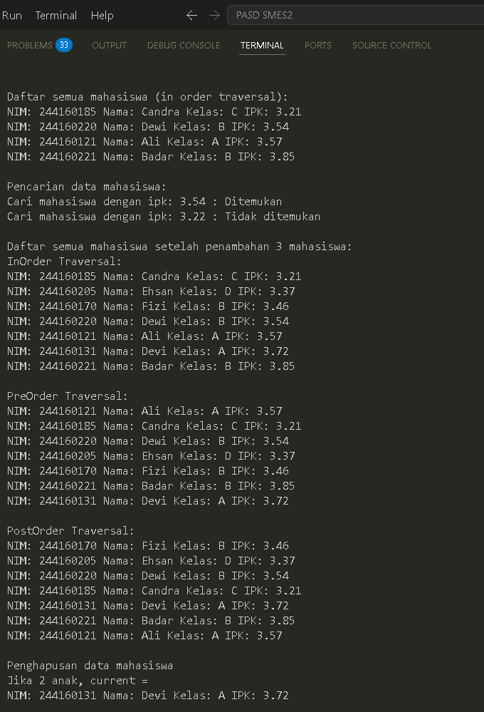

|  | Algorithm and Data Structure |
|--|--|
| NIM |  254107020090|
| Nama |  Rajendra Putra Maheswara |
| Kelas | TI - 1F |
| Repository | (https://github.com/AndraMaheswara/PrakASD) |

## 14.2 Kegiatan Praktikum 1 Implementasi Binary Search Tree menggunakan Linked List

### 14.2.2 Pertanyaan
**1. Mengapa dalam binary search tree proses pencarian data bisa lebih efektif dilakukan dibanding
binary tree biasa?**
Proses pencarian pada Binary Search Tree (BST) jauh lebih efektif karena memiliki aturan penempatan data yang terstruktur: semua data di sub-tree kiri selalu lebih kecil dari parent, dan semua data di sub-tree kanan selalu lebih besar.
Pada BST: Setiap kali kita membandingkan data, kita bisa langsung mengeliminasi setengah dari sisa tree yang tidak memenuhi syarat (mirip konsep Binary Search). Kompleksitas waktunya rata-rata adalah O(log n).
Pada Binary Tree Biasa: Data dimasukkan tanpa aturan urutan tertentu. Akibatnya, untuk mencari suatu data, kita terpaksa melakukan pencarian secara acak atau memeriksa seluruh node satu per satu (Sequential Search) dengan kompleksitas O(n).

**2. Untuk apakah di class Node, kegunaan dari atribut left dan right?**
Atribut left dan right bertipe objek Node yang berfungsi sebagai pointer atau referensi (penghubung) ke node anak (child node):
left: Menyimpan alamat memori atau referensi menuju node anak di sebelah kiri (yang memiliki nilai data lebih kecil).
right: Menyimpan alamat memori atau referensi menuju node anak di sebelah kanan (yang memiliki nilai data lebih besar).

**3. a. Untuk apakah kegunaan dari atribut root di dalam class BinaryTree?
b. Ketika objek tree pertama kali dibuat, apakah nilai dari root?**
a. Kegunaan atribut root: Sebagai titik awal atau pintu masuk utama dari seluruh struktur tree. Semua operasi seperti pencarian (find), penambahan (add), penghapusan (delete), dan penelusuran (traverse) wajib dimulai dari koordinat root.
b. Nilai root saat pertama kali dibuat: Bernilai null, karena tree baru dibuat dan belum memiliki node sama sekali (kosong).

**4. Ketika tree masih kosong, dan akan ditambahkan sebuah node baru, proses apa yang akan terjadi?**
Ketika tree masih kosong (root == null), jalannya method add() adalah sebagai berikut:
Program akan membuat objek node baru (newNode) yang menampung data mahasiswa.
Kondisi if (isEmpty()) atau if (root == null) akan bernilai true.
Program langsung mengeksekusi baris root = newNode;. Artinya, node baru tersebut langsung dinobatkan sebagai root utama. Perulangan while(true) di bawahnya tidak akan dijalankan sama sekali.

**5. Perhatikan method add(), di dalamnya terdapat baris program seperti di bawah ini. Jelaskan
secara detil untuk apa baris program tersebut?**
Potongan kode perulangan while(true) tersebut berfungsi untuk mencari posisi daun (leaf node) kosong yang tepat untuk menempatkan newNode secara non-rekursif:
parent = current; : Menyimpan node saat ini sebagai 'orang tua', karena setelah baris ini variabel current akan bergeser turun ke bawah.
if (mahasiswa.ipk < current.mahasiswa.ipk) : Mengecek apakah IPK mahasiswa baru lebih kecil dari IPK node saat ini.
Jika ya, current bergeser ke kiri (current = current.left). Jika ternyata cabang kiri kosong (current == null), maka newNode dipasang di situ (parent.left = newNode) dan program keluar dari method (return).
else : Jika IPK mahasiswa baru lebih besar atau sama dengan IPK node saat ini.
current akan bergeser ke kanan (current = current.right). Jika cabang kanan kosong (current == null), maka newNode dipasang di situ (parent.right = newNode) dan program keluar dari method (return).

**6. Jelaskan langkah-langkah pada method delete() saat menghapus sebuah node yang memiliki dua
anak. Bagaimana method getSuccessor() membantu dalam proses ini?**
Langkah-langkah Penghapusan:
Method delete() mendeteksi bahwa node yang dicari (current) memiliki left != null dan right != null.
Program memanggil method getSuccessor(current) untuk mencari node pengganti yang paling ideal.
Node pengganti (suksesor) ini diambil dari node dengan nilai terkecil di sub-tree sebelah kanan (caranya dengan pergi ke kanan satu kali, lalu telusuri cabang kiri sampai habis/mentok).
Di dalam getSuccessor(), jika suksesor memiliki anak kanan, anak tersebut dititipkan ke parent suksesor. Kemudian suksesor diangkat ke atas untuk mengambil alih posisi cabang kanan node yang dihapus.
Kembali ke method delete(), parent dari current (node yang dihapus) dihubungkan ke successor.
Terakhir, anak kiri dari node yang dihapus dipasangkan ke suksesor (successor.left = current.left).

Bagaimana getSuccessor() membantu?
Method ini membantu menjaga agar struktur dan aturan BST tidak rusak. Dengan memilih nilai terkecil di sub-tree kanan, kita mendapatkan nilai yang pasti lebih besar dari semua node di sub-tree kiri, namun tetap lebih kecil dari sisa node di sub-tree kanan.

___

## 14.2 Kegiatan Praktikum 1 Implementasi Binary Search Tree menggunakan Linked List

### 14.2.2 Pertanyaan
