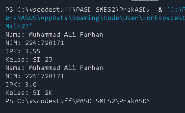
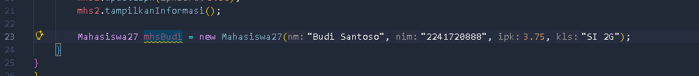

|  | Algorithm and Data Structure |
|--|--|
| NIM |  254107020090|
| Nama |  Rajendra Putra Maheswara |
| Kelas | TI - 1F |
| Repository | (https://github.com/AndraMaheswara/PrakASD) |

# 2.1 Percobaan 1: Deklarasi Class, Atribut dan Method
### 2.1.2 Verifikasi Hasil Percobaan

### 2.1.3 Pertanyaan
1. Sebutkan dua karakteristik class atau object!

Atribut (State / Properties): Data atau variabel yang menyimpan informasi tentang keadaan suatu objek (misalnya: nama, nim, ipk).

Method (Behavior / Fungsi): Tindakan atau operasi yang dapat dilakukan oleh objek tersebut (misalnya: mengubah kelas, menampilkan informasi).

2. Perhatikan class Mahasiswa pada Praktikum 1 tersebut, ada berapa atribut yang dimiliki oleh class
Mahasiswa? Sebutkan apa saja atributnya!

ada 4
nama (String)

nim (String)

kelas (String)

ipk (double)

3. Ada berapa method yang dimiliki oleh class tersebut? Sebutkan apa saja methodnya!

4 method 

tampilkanInformasi() Menampilkan data mahasiswa ke layar.

ubahKelas(String kelasBaru) Mengubah nilai dari atribut kelas.

updateIpk(double ipkBaru) Mengubah nilai dari atribut ipk.

nilaiKinerja() Mengembalikan status kinerja mahasiswa berdasarkan nilai IPK-nya.

4. Perhatikan method updateIpk() yang terdapat di dalam class Mahasiswa. Modifikasi isi method
tersebut sehingga IPK yang dimasukkan valid yaitu terlebih dahulu dilakukan pengecekan apakah
IPK yang dimasukkan di dalam rentang 0.0 sampai dengan 4.0 (0.0 <= IPK <= 4.0). Jika IPK tidak
pada rentang tersebut maka dikeluarkan pesan: "IPK tidak valid. Harus antara 0.0 dan 4.0".

(image)

5. Jelaskan bagaimana cara kerja method nilaiKinerja() dalam mengevaluasi kinerja mahasiswa,
kriteria apa saja yang digunakan untuk menentukan nilai kinerja tersebut, dan apa yang
dikembalikan (di-return-kan) oleh method nilaiKinerja() tersebut?

method ini mengecek IPK menggunakan if - else. jika satu kondisi terpenuhi, program langsung mengembalikan nilai dan mengabaikan pengecekan dibawahnya.

Jika IPK >= 3.5, maka kinerjanya "Sangat baik".
Jika IPK >= 3.0 (dan < 3.5), maka kinerjanya "Baik".
Jika IPK >= 2.0 (dan < 3.0), maka kinerjanya "Cukup".
Jika IPK di bawah 2.0 (kondisi else), maka kinerjanya "Kurang".

Return Value: String yang menunjukan evaluasi kerja.

# 2.2 Percobaan 2: Instansiasi Object, serta Mengakses Atribut dan Method
### 2.2.2 Verifikasi Hasil Percobaan

### 2.2.3 Pertanyaan
1. Pada class MahasiswaMain, tunjukkan baris kode program yang digunakan untuk proses
instansiasi! Apa nama object yang dihasilkan?

Mahasiswa mhs1 = new Mahasiswa(); dan objek nya adalah mhs1

2. Bagaimana cara mengakses atribut dan method dari suatu objek?

menggunakan operator titik ( . ) setelah nama objek. mhs1.nama = "Muhammad Ali Farhan"; untuk mengakses nama

3. Mengapa hasil output pemanggilan method tampilkanInformasi() pertama dan kedua berbeda?

karena terdapat perubahan nilai atribut pada objek di antara kedua pemanggilan tersebut

# 2.3 Percobaan 3: Membuat Konstruktor

###2.3.2 Verifikasi Hasil Percobaan

(image)

###2.3.3 Pertanyaan

1. Pada class Mahasiswa di Percobaan 3, tunjukkan baris kode program yang digunakan untuk
mendeklarasikan konstruktor berparameter!

public Mahasiswa(String nm, String nim, double ipk, String kls) {
    nama = nm;
    this.nim = nim;
    this.ipk = ipk;
    kelas = kls;

2. Perhatikan class MahasiswaMain. Apa sebenarnya yang dilakukan pada baris program
berikut?

instansiasi objek baru

3. Hapus konstruktor default pada class Mahasiswa, kemudian compile dan run program.
Bagaimana hasilnya? Jelaskan mengapa hasilnya demikian!

Program akan mengalami error pada saat kompilasi (compile-time error).

4. Setelah melakukan instansiasi object, apakah method di dalam class Mahasiswa harus diakses
secara berurutan? Jelaskan alasannya! tidak harus urut, objek tersebut yang dapat dipanggil kapan saja selama objeknya sudah terbentuk

5. Buat object baru dengan nama mhs<NamaMahasiswa> menggunakan konstruktor
berparameter dari class Mahasiswa!

# 2.4 Latihan Praktikum
