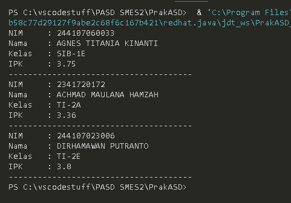
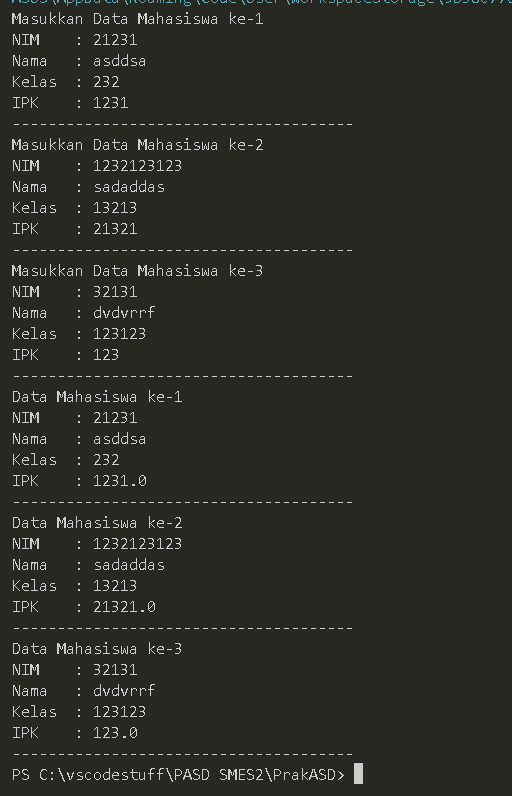
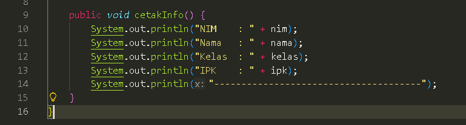
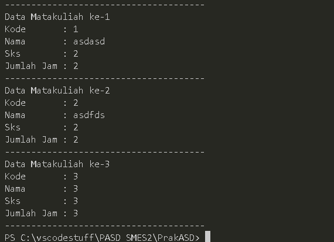
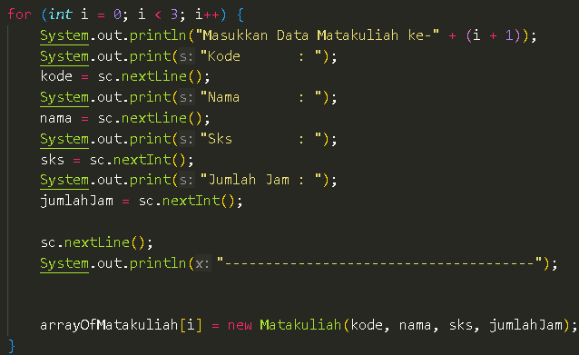
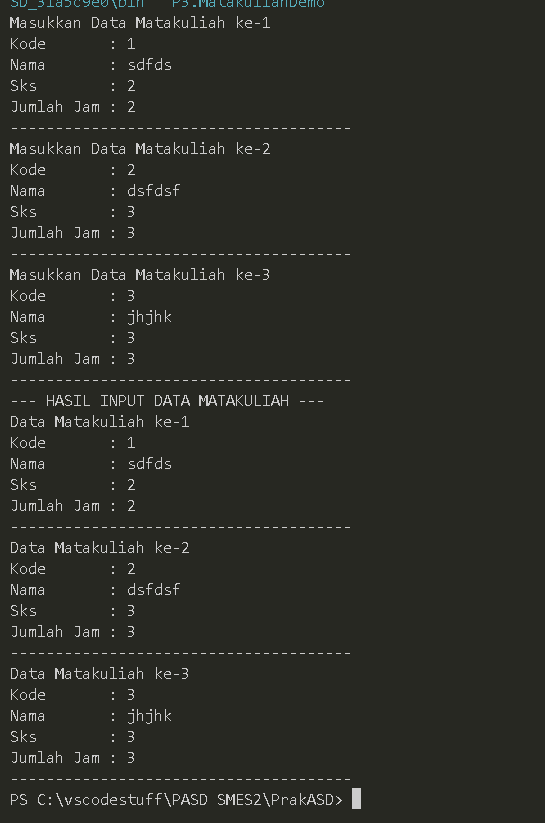
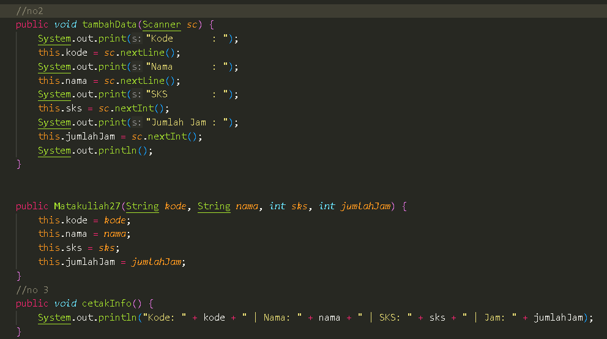
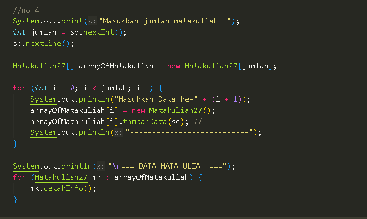
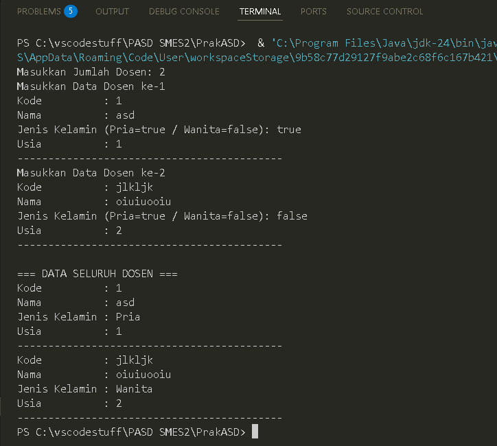

|  | Algorithm and Data Structure |
|--|--|
| NIM |  254107020090|
| Nama |  Rajendra Putra Maheswara |
| Kelas | TI - 1F |
| Repository | (https://github.com/AndraMaheswara/PrakASD) |


# 3.2 Membuat Array dari Object, Mengisi dan Menampilkan
### 3.2.2 Verifikasi Hasil Percobaan



### 3.2.3 Pertanyaan
1. Berdasarkan uji coba 3.2, apakah class yang akan dibuat array of object harus selalu memiliki
atribut dan sekaligus method? Jelaskan!

   Tidak. Namun idealnya memiliki keduanya.

2. Apa yang dilakukan oleh kode program berikut?
   ```Mahasiswa[] arrayOfMahasiswa = new Mahasiswa[3];```

   Membuat tempat untuk 3 object Mahasiswa.
   
3. Apakah class Mahasiswa memiliki konstruktor? Jika tidak, kenapa bisa dilakukan pemanggilan
konstruktur pada baris program berikut?

   Sudah ada Default Constructor dari java itu sendiri.

5. Apa yang dilakukan oleh kode program berikut?
<pre>arrayofMahasiswa [0] = new Mahasiswa () ;
arrayOfMahasiswa [0].nim = "244107060033";
arrayofMahasiswa [0] . nama = "AGNES TITANIA KINANTI";
arrayofMahasiswa [0] . kelas = "SIB-1E";
arrayOfMahasiswa [0].ipk = (float) 3.75;</pre>

   Instansiasi object dan pengisian data.

5. Mengapa class Mahasiswa dan MahasiswaDemo dipisahkan pada uji coba 3.2?

   Class Mahasiswa bertindak sebagai data model dan Class MahasiswaDemo bertindak sebagai Driver Class. Class Mahasiswa juga dapat dipakai di class lain jika diperlukan

# 3.3 Menerima Input Isian Array Menggunakan Looping
### 3.3.2 Verifikasi Hasil Percobaan



### 3.3.3 Pertanyaan

1. Tambahkan method cetakInfo() pada class Mahasiswa kemudian modifikasi kode program
pada langkah no 3.



2. Misalkan Anda punya array baru bertipe array of Mahasiswa dengan nama
myArrayOfMahasiswa. Mengapa kode berikut menyebabkan error?
karena index nya masih kosong


# 3.4 Constructor Berparameter
### 3.4.2 Verifikasi Hasil Percobaan





### 3.4.3 Pertanyaan

1. Apakah suatu class dapat memiliki lebih dari 1 constructor? Jika iya, berikan contohnya

Ya, tapi tipe parameter tiap konstruktor harus berbeda

2. Tambahkan method tambahData() pada class Matakuliah, kemudian gunakan method
tersebut di class MatakuliahDemo untuk menambahkan data Matakuliah

3. Tambahkan method cetakInfo() pada class Matakuliah, kemudian gunakan method
tersebut di class MatakuliahDemo untuk menampilkan data hasil inputan di layar


(gambar untuk nomor 2 dan 3)

4. Modifikasi kode program pada class MatakuliahDemo agar panjang (jumlah elemen) dari
array of object Matakuliah ditentukan oleh user melalui input dengan Scanner



# 3.5 Tugas

