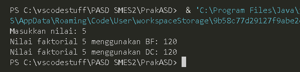
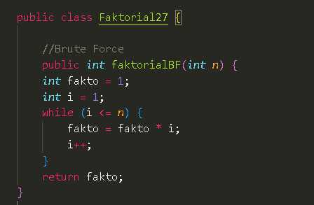
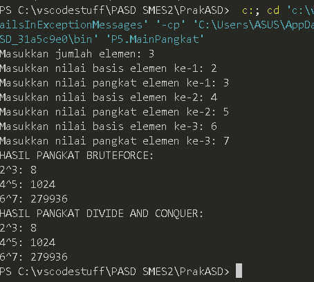
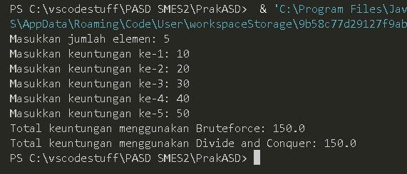
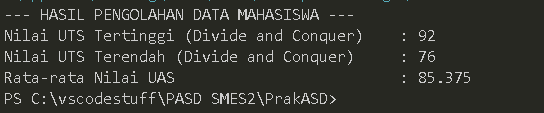

|  | Algorithm and Data Structure |
|--|--|
| NIM |  254107020090|
| Nama |  Rajendra Putra Maheswara |
| Kelas | TI - 1F |
| Repository | (https://github.com/AndraMaheswara/PrakASD) |


# 5.2 Menghitung Nilai Faktorial dengan Algoritma Brute Force dan Divide and Conquer

### 5.2.2. Verifikasi Hasil Percobaan



### 5.2.3. Pertanyaan
1. Pada base line Algoritma Divide Conquer untuk melakukan pencarian nilai faktorial, jelaskan
perbedaan bagian kode pada penggunaan if dan else!

```if (n == 1)``` berguna untuk menghentikan kode agar tidak terjadi infinite recursion
```else``` berguna untuk memecah masalah besar menjadi lebih kecil

2. Apakah memungkinkan perulangan pada method ```faktorialBF()``` diubah selain menggunakan
for? Buktikan!



4. Jelaskan perbedaan antara ```fakto *= i;``` dan ```int fakto = n * faktorialDC(n-1);``` !

```fakto *= i``` dilakukan di dalam sebuah perulangan
```int fakto = n * faktorialDC(n-1)``` melakukanpemanggilan fungsi baru sebelum perkalian selesai dilakukan.

4. Buat Kesimpulan tentang perbedaan cara kerja method ```faktorialBF()``` dan ```faktorialDC()```!
```faktorialBF()``` (Brute Force): Menggunakan cara iteratif (perulangan). Masalah diselesaikan secara langsung dengan mengalikan angka satu demi satu dari awal sampai akhir. Lebih hemat memori karena tidak ada penumpukan pemanggilan fungsi.

```faktorialDC()``` (Divide & Conquer): Menggunakan cara rekursif (pemanggilan diri sendiri). Masalah besar dipecah menjadi bagian-bagian kecil sampai yang terkecil (base case), lalu hasilnya digabungkan kembali. Penulisan kode lebih ringkas namun menggunakan lebih banyak memori untuk menyimpan tumpukan fungsi (stack).


# 5.3 Menghitung Hasil Pangkat dengan Algoritma Brute Force dan Divide and Conquer
### 5.3.2. Verifikasi Hasil Percobaan



### 5.3.3. Pertanyaan
1. Jelaskan mengenai perbedaan 2 method yang dibuat yaitu ```pangkatBF()``` dan ```pangkatDC()```!

```pangkatBF()```: Menyelesaikan perpangkatan dengan cara iteratif atau perulangan linier.
```pangkatDC()```: Menyelesaikan perpangkatan dengan memecah pangkat menjadi dua bagian ```(n/2)``` di setiap tahap rekursi.
  
2. Apakah tahap combine sudah termasuk dalam kode tersebut?Tunjukkan!

Ya, tahap combine sudah termasuk. Tahap ini terjadi saat hasil dari sub-masalah dikalikan kembali untuk mendapatkan hasil akhir.
   
3. Pada method ```pangkatBF()``` terdapat parameter untuk melewatkan nilai yang akan dipangkatkan
dan pangkat berapa, padahal di sisi lain di class Pangkat telah ada atribut nilai dan pangkat,
apakah menurut Anda method tersebut tetap relevan untuk memiliki parameter? Apakah bisa
jika method tersebut dibuat dengan tanpa parameter? Jika bisa, seperti apa method
```pangkatBF()``` yang tanpa parameter?

Relevan? method tersebut tetap relevan jika ingin digunakan secara fleksibel. Namun, jika tujuannya hanya menghitung atribut milik objek itu sendiri, maka parameter tersebut menjadi boros.
Tanpa parameter? Bisa, method tersebut dapat dibuat tanpa parameter dengan langsung mengakses atribut nilai dan pangkat yang ada di dalam class.

```
public int pangkatBF() {
    int hasil = 1;
    for (int i = 0; i < pangkat; i++) {
        hasil = hasil * nilai;
    }
    return hasil;
}
```

4. Tarik tentang cara kerja method ```pangkatBF()``` dan ```pangkatDC()```!

Cara Kerja ```pangkatBF()```: Program melakukan perulangan dari 0 sampai n-1. Di setiap loop, nilai basis dikalikan ke variabel hasil. Jika pangkatnya 1000, maka akan terjadi 1000 kali perkalian.

Cara Kerja ```pangkatDC()```: Masalah dipecah menjadi setengahnya secara terus menerus. Jika pangkatnya ganjil, hasil bagi dua dikalikan lagi dengan basisnya.

# 5.4 Menghitung Sum Array dengan Algoritma Brute Force dan Divide and Conquer
### 5.4.2. Verifikasi Hasil Percobaan



### 5.4.3. Pertanyaan
1. Kenapa dibutuhkan variable mid pada method ```TotalDC()```?
  Variabel ```mid``` dibutuhkan untuk menentukan titik tengah dari jangkauan array.

2. Untuk apakah statement di bawah ini dilakukan dalam ```TotalDC()```?
    ```
    double lsum = totalDC(arr, 1, mid);
    double rsum = totalDC(arr, mid+1, r);
    ```
    ```lsum``` menghitung total nilai pada bagian kiri array (dari indeks l sampai mid).
    ```rsum```  menghitung total nilai pada bagian kanan array (dari indeks mid+1 sampai r).

3. Kenapa diperlukan penjumlahan hasil lsum dan rsum seperti di bawah ini?
   karena Divide and Conquer memecah array maka diperlukan penjumlahan dari pecahan array tersebut.
   
4. Apakah base case dari ```totalDC()```?
   ketika kondisi ``if (l == r)`` terpenuhi.
   
5. Tarik Kesimpulan tentang cara kerja ```totalDC()```
    Method ```totalDC()``` bekerja dengan membagi array secara terus-menerus menjadi dua bagian hingga mencapai Base Case. lalu dikembalikan ke atas dan dijumlahkan tahap demi tahap hingga menghasilkan total akhir.

### 4.5 Latihan Praktikum


